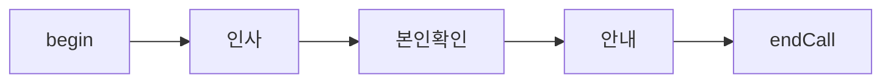
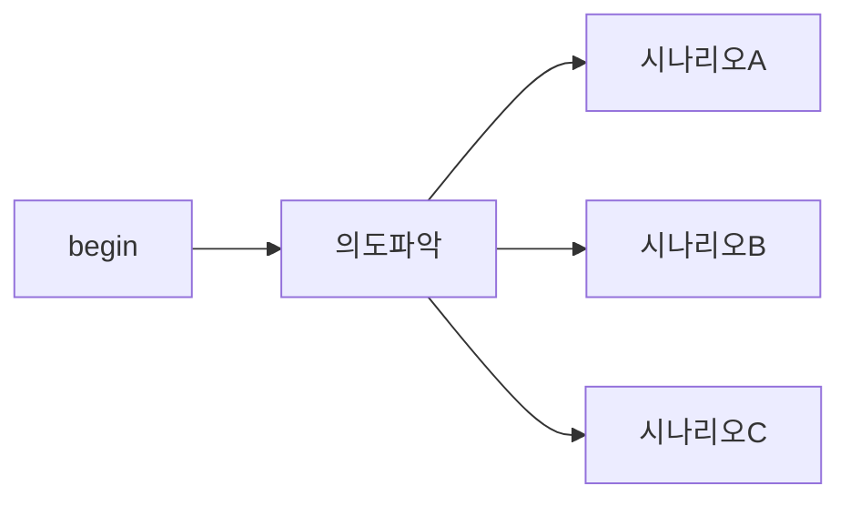
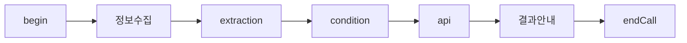
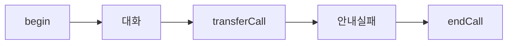

# Flow 설계 통합 가이드

vox.ai flow agent 의 구조와 설계 원칙을 이해하기 위한 가이드. flow 를 처음 설계하거나, 기존 flow 를 수정할 때 읽는다.

본 가이드는 **v3 API / vox.ai MCP `flow_data` workflow** 기준이다. 정확한 node type, data field, enum, required 여부는 문서에 고정하지 않고 MCP schema endpoint 결과를 따른다.

## Schema-first workflow

flow JSON 을 작성하거나 수정할 때는 먼저 현재 schema 를 가져온다.

```text
get_schema(namespace="flow-schema", schema_type="flow-data")
```

agent `data` 도 같이 다루면 필요한 schema 를 별도로 가져온다.

```text
get_schema(namespace="agent-schema", schema_type="agent-data-create")
get_schema(namespace="agent-schema", schema_type="agent-data-update")
```

이 문서와 `node-types.md` 는 설계 원칙과 실수 방지용이다. 실제 payload 는 schema endpoint 응답을 기준으로 만들고, 전송 후 `get_agent` 로 round-trip 확인한다.

## v3 Flow Schema

flow 는 **nodes** (노드 목록) 와 **edges** (연결 목록) 로 이루어진 방향 그래프다.

```
FlowData {
  nodes: FlowNode[]
  edges: FlowEdge[]
}
```

전체 schema 는 **camelCase**. 클라이언트가 unknown 필드를 보내면 서버는 **validation error 없이 silently drop** 한다 (`extra="allow"` / `extra="ignore"` 모드 혼재) — 보낸 필드가 응답에 안 보이면 schema 어긋남이다. 응답을 그대로 다시 받아 비교하는 round-trip 검증이 필수.

기본 schema 의 가장 작은 합법 flow → [default-flow-data.json](default-flow-data.json) 참조.

### FlowNode

```
FlowNode {
  id: string                  // flow 안에서 unique. 1..64 chars.
  type: NodeType              // begin | conversation | extraction | condition | api | tool | sendSms | transferCall | transferAgent | endCall | knowledge | function | note
  data: NodeData              // type 별 schema 는 schema endpoint 기준
  position: { x: number, y: number }   // 픽셀 좌표 — 누락 시 NODE_POSITION_REQUIRED 로 reject
}
```

- 모든 노드의 `data` 에는 공통 필드 `name?` (에디터 라벨), `globalNodeSettings?: {isGlobalNode, transitionCondition?}`, 그리고 `transitions[]` (이 노드의 outgoing 분기 list) 가 있다.
- 분기 라우팅 정보는 **노드 내부의 `transitions[]` / `logicalTransitions[]` 에 모두 있다.** edge 는 그걸 가리키는 wiring 일 뿐이다.

### FlowEdge

```
FlowEdge {
  id: string                  // edge 식별자
  source: string              // 출발 node.id
  target: string              // 도착 node.id
  type: "custom"              // 항상 "custom" — 생략 시 backend 가 채우지만 명시 권장
  sourceHandle: string        // source 노드의 data.transitions[].id 또는 data.logicalTransitions[].id 와 일치해야 한다
  targetHandle?: string|null  // 일반적으로 null
}
```

- **edge 자체에는 `condition` 객체가 없다.** 분기 라우팅 정보는 source 노드의 transition 안에 있다.
- `sourceHandle` 가 source 노드 transition 의 id 와 안 맞으면 edge 가 dangling 상태로 저장되어 runtime 에서 무시된다.

### Transition (노드 내부 분기 단위)

ordinary transition (대화 컨텍스트 또는 generic 분기):

```jsonc
{
  "id": "tr_consent_yes",
  "condition": "고객이 조사에 동의하거나 응하겠다고 의사를 표현한 경우",
  "isSkipUserResponse": false,   // optional
  "isFallback": false            // optional
}
```

- `condition` — **항상 의미 있는 한국어 문장.** 빈 문자열, 공백, null 금지. 에디터 라벨이자 LLM 의 라우팅 근거.
- `isFallback: true` — deterministic 실패/default 경로. 캐노니컬 한국어 문구 (생략 금지):
  - `api`, `function`, `tool`, `sendSms` → `condition: "요청 실패 시"`
  - `transferAgent`, `transferCall` → `condition: "에러 발생 시"`
  - 그 외 (condition 노드의 fallback 등) → 의미 있는 한국어 문장
- `isSkipUserResponse: true` — 유저 응답 없이 자동 진행. UI 가 "유저 응답 건너뛰기" 라벨로 렌더하므로 `condition` 생략 가능.

LogicalTransition (변수 기반 deterministic 분기 — 주로 `condition` / `api` 노드):

```jsonc
{
  "id": "lt_promoter",
  "condition": {
    "logicalOperator": "and",
    "conditions": [
      {
        "variable": "nps_score",
        "operator": "greater_than_or_equal",
        "value": 9
      }
    ]
  },
  "isSkipUserResponse": true
}
```

- `condition.conditions[].operator` 는 schema endpoint 의 enum 을 따른다 (equals, not_equals, contains, does_not_contain, greater_than, greater_than_or_equal, less_than, less_than_or_equal, exists, does_not_exist).
- `exists` / `does_not_exist` 만 `value` 생략 가능.
- `condition` 노드는 `transitions[]` 에 fallback 1 개 + `logicalTransitions[]` 에 logic 분기 N 개로 구성한다.

### Per-노드 transition 패턴

- **begin**: `transitions[]` 에 1 개 (보통 `{ id: "tr_begin_next" }`). condition 생략 가능 — begin 은 분기 안 함.
- **conversation / knowledge**: `transitions[]` 에 자연어 condition 여러 개 (대화 흐름 분기). LLM 이 어떤 transition 으로 갈지 결정한다.
- **extraction**: skip-user-response transition 이 필요하다. 정확한 JSON field 는 schema / dry-run 결과를 따른다.
- **condition**: `logicalTransitions[]` 에 logic 분기 + `transitions[]` 에 fallback 1 개.
- **api / tool / function**: `transitions[]` 에 `isFallback: true, condition: "요청 실패 시"` 1 개 + `logicalTransitions[]` (응답 변수 기반) 또는 `transitions[]` 의 다른 자연어 분기.
- **sendSms**: `transitions[]` 에 `isFallback: true, condition: "요청 실패 시"` + 성공 path `transitions[]` 1 개.
- **transferCall / transferAgent**: 실패 fallback route 가 필요하다. 정확한 JSON field 는 schema / dry-run 결과를 따른다.
- **endCall**: `transitions[]` 비어 있어도 됨 (terminal).

## 변수 흐름

flow 에서 변수는 노드 간 데이터를 전달하는 핵심 메커니즘.

### 변수 생성

| 방법 | 노드 | 설명 |
|---|---|---|
| system | (자동) | `{{current_time}}`, `{{call_from}}`, `{{call_to}}` 등 플랫폼 제공 |
| agent 설정 | (사전 주입) | `{{customer_name}}` 등 통화 시작 전 주입 (`agent.data.presetDynamicVariables`) |
| extraction | extraction 노드 | LLM 이 대화에서 추출 → flow 변수로 저장. 변수 정의는 `data.extractionConfiguration.variables[]` 의 `variableName` / `variableType` / `variableDescription` |
| api response | api 노드 | JSONPath 로 API 응답에서 추출. 매핑은 `data.responseVariables[]` 의 `variableName` / `jsonPath` |

### 변수 소비

| 위치 | 사용법 |
|---|---|
| conversation `data.staticSentence` (static) / `data.firstMessage` + `data.prompt` (dynamic) | `{{customer_name}}님의 주문을 확인합니다` |
| api `data.apiConfiguration.url` / `body` | `https://api.example.com/orders/{{order_id}}` |
| transition `condition` (자연어) | `{{is_verified}} 가 true 인 경우` 등 |
| logicalTransition `condition.conditions[].variable` | `nps_score` (변수 이름만) |
| extraction `data.extractionConfiguration.extractionPrompt` | `{{customer_name}} 의 주문번호를 추출하세요` |
| transferCall `data.warmTransferPrompt` | `{{customer_name}} 님이 환불 요청 중입니다` |
| sendSms `data.staticSentence` (static) / `data.prompt` (dynamic) | `{{customer_name}}님 예약이 확정되었습니다` |

### 일반적인 변수 흐름 패턴

```
conversation → extraction → condition → api → conversation
(정보 수집)   (변수 추출)   (조건 분기)  (조회)  (결과 안내)
```

상세 → `variable-system.md` (vox-agents/references/) 참조.

## 설계 원칙

### 1. 노드 수 최소화

불필요한 분할은 edge 관리를 복잡하게 하고 유지보수 비용이 증가한다. 한 conversation 노드가 한 목적을 처리하되, 관련된 확인/재질문은 같은 노드의 `loopCondition` 또는 prompt 안의 행동 규칙으로 처리한다.

### 2. 한 노드 = 한 목적

각 노드가 하나의 명확한 목적을 가져야 한다. "인사 + 본인확인 + 안내" 를 하나에 넣으면 transition condition 이 복잡해지고 디버깅이 어려워진다.

### 3. Global 노드 활용

"통화 종료 요청", "상담원 연결 요청" 같이 어디서든 발생할 수 있는 시나리오는 global node 로 설정한다. 모든 노드에 개별 transition 을 추가하는 것보다 유지보수가 쉽다. 활성화 = `data.globalNodeSettings: { isGlobalNode: true, transitionCondition: "…" }`.

### 4. Fallback 경로 확보

다음 노드는 fallback transition 이 필수다. API는 누락된 transition/빈 condition을 자동 보강하지만, 사용자가 들어야 하는 안내·재시도·상담원 전환 같은 recovery edge 는 설계자가 명시해야 한다.
- **transferCall / transferAgent**: `isFallback: true` 1 개. condition `"에러 발생 시"`.
- **api / function / tool / sendSms**: `isFallback: true` 1 개. condition `"요청 실패 시"`.
- **condition**: `logicalTransitions[]` 외에 `transitions[]` 에 fallback 1 개. condition 한국어 문장 (예: `"위 조건이 모두 거짓일 때"`).

다음 노드는 fallback 권장 (없어도 backend 가 강제하지는 않음):
- **conversation**: 예상 외 응답을 처리할 transition (예: `"고객이 거절했거나 통화를 끊으려는 경우"`).

### 5. Extraction 전에 Conversation

extraction 노드는 기존 대화 컨텍스트에서 추출한다. 필요한 정보가 대화에 아직 없으면 extraction 이 빈 값을 반환한다. 반드시 conversation 노드에서 정보를 수집한 후 extraction 을 배치한다. extraction 은 `data.isSkipUserResponse: true` 가 기본이라 사용자 응답을 기다리지 않으며, transition 에 `isSkipUserResponse: true` 가 1 개 이상 필수다.

### 6. Condition 노드는 logic 분기 전용

condition 노드의 `data` 에는 `name` / `globalNodeSettings` / `transitions` / `logicalTransitions` 외에 분기 필드를 넣지 않는다. 분기는 `logicalTransitions[]` (logic) + `transitions[]` (fallback 1 개).

## 설계 패턴

### Linear (순차)



분기 없이 순서대로 진행. 각 conversation transition 에 의미 있는 condition 을 적되, 다음 단계로 넘어가는 단일 transition 이면 condition 은 `"고객이 응답을 마친 경우"` 같이 자연스럽게 작성.

### Branching (분기)



고객 의도에 따라 다른 시나리오로 분기. conversation 노드의 `transitions[]` 에 자연어 condition 여러 개 → 각각 다른 target 노드로 edge.

### Data Collection (데이터 수집)



고객 정보 수집 → 변수 추출 → 조건 확인 → 외부 조회 → 결과 안내. condition 노드는 `logicalTransitions[]` 로 deterministic 분기.

### Transfer Fallback (전환 + 복구)



transferCall 노드는 `isFallback: true, condition: "에러 발생 시"` transition 이 필수다 (성공 path 는 통화 자체가 다른 측으로 넘어가므로 명시 안 함).

## API / MCP 로 Flow 만들고 수정

vox.ai MCP 와 v3 REST 모두 동일한 `flow_data` schema 를 받는다. **수정은 전체 교체 (full replacement)** — 기존 nodes / edges 일부만 patch 하는 모드는 v3 단일 endpoint 에 없다. PATCH 시에도 nodes / edges 전체를 다시 보낸다.

작업 순서:

1. `get_schema(namespace="flow-schema", schema_type="flow-data")` 로 현재 flow schema 를 확인한다.
2. agent `data` 를 보낼 경우 `get_schema(namespace="agent-schema", schema_type="agent-data-create")` 또는 `agent-data-update` 를 확인한다.
3. `validate_flow_data` 로 dry-run 검증 (자동 fix 미리보기 + blocking error 확인).
4. `create_agent(name=..., type="flow", data=..., flow_data=...)` 또는 `update_agent(flow_data=...)` 호출.
5. `get_agent` 로 다시 읽어 unknown field drop, enum mismatch, 누락 edge 를 확인한다.

### 생성 (REST 또는 MCP)

REST:
```jsonc
POST /v3/agents
{
  "name": "My Flow Agent",
  "type": "flow",                 // ← 누락하면 single_prompt 로 떨어져 flow_data 가 null 로 저장됨
  "data": { ... },                // agent.data (vox-agents/references/default-agent-data.json 참고)
  "flow_data": {
    "nodes": [...],
    "edges": [...]
  }
}
```

vox.ai MCP (Claude Code 등 client 에서 호출):
```text
mcp__vox__create_agent(
  name="My Flow Agent",
  type="flow",
  data={ ... },
  flow_data={ "nodes": [...], "edges": [...] }
)
```

### 수정

REST:
```jsonc
PATCH /v3/agents/{id}
{
  "flow_data": { "nodes": [...], "edges": [...] }
}
```

vox.ai MCP:
```text
mcp__vox__update_agent(
  agent_id="<UUID>",
  flow_data={ "nodes": [...], "edges": [...] }
)
```

전체 nodes / edges 다시 보내는 형태. 일부만 빼면 그 노드/엣지가 삭제된다.

### 조회

REST:
```text
GET /v3/agents/{id}    # 응답에 flow_data 포함
```

vox.ai MCP:
```text
mcp__vox__get_agent(agent_id="<UUID>")   # 응답에 flow_data 포함
```

### Round-trip 검증 (필수)

`flow_data` 는 unknown 필드를 silent drop 할 수 있다. 전송 후 항상 응답을 다시 비교해서 의도한 노드 / 엣지 / 필드가 그대로 들어갔는지 확인한다. 보낸 필드가 응답에 없으면 로컬 문서를 고치려 들기 전에 schema endpoint 결과와 payload 를 다시 대조한다.

특히 다음을 점검:
- `type: "flow"` 가 top-level 에 있는가? (없으면 `single_prompt` 로 저장되어 flow_data 가 null)
- 모든 node 에 `position: {x, y}` 가 있는가? (없으면 `NODE_POSITION_REQUIRED`)
- 모든 edge 의 `sourceHandle` 가 source 노드의 transition.id 와 일치하는가? (안 맞으면 dangling)
- extraction 노드에 `isSkipUserResponse: true` 인 transition 이 1 개 이상 있는가?
- transferCall / transferAgent 노드에 `isFallback: true` 인 transition 이 1 개 이상 있는가?
- 모든 transition.condition 이 의미 있는 한국어 문장인가? (빈 문자열 금지, fallback 은 캐노니컬 문구)
